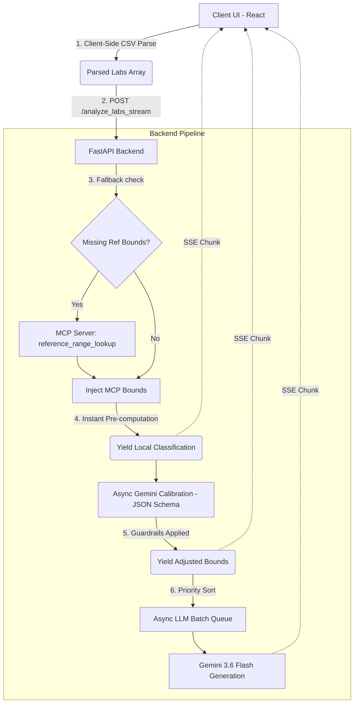

# Comprehensive Technical Documentation
**Project:** LabInsight  
**Objective:** A full-stack AI platform to triage, analyze, and explain clinical lab results in real-time, strictly adhering to the principles of Explainable AI (XAI).

---

## 1. System Architecture Overview

The system is designed as a decoupled, real-time streaming architecture.



---

## 2. Core Features & Code Flow

### A. Real-Time SSE Streaming Pipeline
**Problem:** Generating deep clinical LLM analysis for 10-30 lab results takes time, and cloud LLMs (like Gemini) have rate limits (e.g., 5 RPM). Serial execution freezes the UI.
**Solution:**
1. **Instant Feedback:** As soon as the frontend sends the POST request, the backend (`agent.py`) instantly applies deterministic math (e.g., `Result > Max_Reference`) and yields a "Pending" result over Server-Sent Events (SSE). The UI instantly renders the skeleton cards.
2. **Batch Queueing:** The `LabQueue` groups tests into batches of 5, triggering `asyncio.gather` for parallel LLM generation, then deliberately sleeps (`asyncio.sleep`) to respect rate limits before executing the next batch.
3. **Live UI Updates:** As each LLM response finishes, it streams to the frontend. The React Reducer intercepts the stream chunk and hot-swaps the pending card with the final explanation.

### B. Context-Aware Dynamic Triage (Explainable AI)
**Problem:** A standard reference range for Glucose (70-99) is universally applied, but for a known Diabetic patient, 125 might be perfectly acceptable. If the AI silently adjusts this, the clinician doesn't know *why*.
**Solution:**
1. The frontend collects **Global Patient Context** (e.g., "Type 2 Diabetic").
2. The backend sends a strictly-typed JSON schema request to Gemini to calibrate the reference bounds specifically for that patient context.
3. **Guardrails (`agent.py`):** 
   - *Guardrail 1 (Clamp Constraint)*: The AI is mathematically forbidden from altering bounds by more than ±40% of standard ranges.
   - *Guardrail 2 (Fixed Criticals)*: The boundary between `Warning` and `Critical` is hardcoded to prevent the AI from downgrading a true physiological emergency.
   - *Guardrail 3 (Fail-Closed)*: If the calibration API call fails, times out, or returns malformed JSON, the system intercepts the exception and silently falls back to standard bounds, guaranteeing that the row never hangs or crashes.
   - *Guardrail 4 (Schema Constraint)*: The calibration pipeline inherently filters out hallucinated keys. If the LLM generates an adjustment for a test name that wasn't in the uploaded batch, it is immediately discarded.
4. **Visual XAI Dual-Gauge:** Once calibrated, the backend streams a transition state. The frontend `ResultsDisplay.jsx` renders a dynamic gauge showing a dotted line for the *original* standard range, and a solid line for the *new* patient-adjusted range, flagging it explicitly with `Adjusted for patient context`.

### C. Model Context Protocol (MCP) Integration
**Problem:** Datasets often have missing reference ranges.
**Solution:** 
We built an isolated tool-calling node using `FastMCP`.
- **Server (`mcp_server.py`)**: Hosts local tools like `reference_range_lookup`.
- **Client (`agent.py`)**: Uses `mcp.client.stdio` to spawn the MCP server process locally over standard input/output. If a parsed lab result lacks bounds, the Agent sends a JSON-RPC request to the MCP server to fetch the fallback bounds before passing the data to the LLM.

### D. Priority Routing & Urgency
The `Agent` mathematically pre-classifies all incoming results. Before entering the async LLM queue, the list is aggressively sorted:
1. `Critical` tests are placed at the front of the queue.
2. `Warning` tests are placed next.
3. `Normal` tests are placed last.

During the final LLM generation, Gemini is prompted via JSON schema to output:
- **Urgency**: `STAT`, `URGENT`, or `ROUTINE`.
- **Routing Specialty**: E.g., `Hematology`, `Cardiology`.
These tags are rendered natively on the UI cards alongside a dynamic deviation percentage (e.g., `+26.3%`).

---

## 3. API Documentation

### `POST /analyze_labs_stream`
Used by the React frontend. Accepts an array of labs and streams `AnalyzedResult` JSON objects back to the client continuously via Server-Sent Events (SSE).

**Payload Requirements:**
```json
{
  "labs": [
    {
      "test_name": "Glucose",
      "result": 125.0,
      "unit": "mg/dL",
      "min_reference": 70,
      "max_reference": 99
    }
  ],
  "patient_context": "Type 2 Diabetic"
}
```

### `POST /analyze_labs`
Used for automated grading / legacy API consumers. Accepts the exact same payload but blocks the connection until the entire queue finishes processing, returning a single flat JSON array of results.

---

## 4. Frontend Component Structure

- **`App.jsx`**: Holds the main state reducer. Intercepts the SSE stream chunk-by-chunk and dispatches `UPDATE_RESULT` actions to hot-swap React state.
- **`LabInput.jsx`**: Handles drag-and-drop CSV uploads. Invokes `PapaParse` entirely client-side to offload processing from the server.
- **`ResultsDisplay.jsx`**: Renders the KPI summary, the global Patient Context banner, and the list of stacked cards.
- **`RangeGauge` (inside ResultsDisplay)**: A complex CSS-driven visual component that maps numeric values to a percentage scale `(0-100%)`. Computes math dynamically to render the marker dot, the normal green zone, the dotted original standard zone, and the deviation tooltip.
