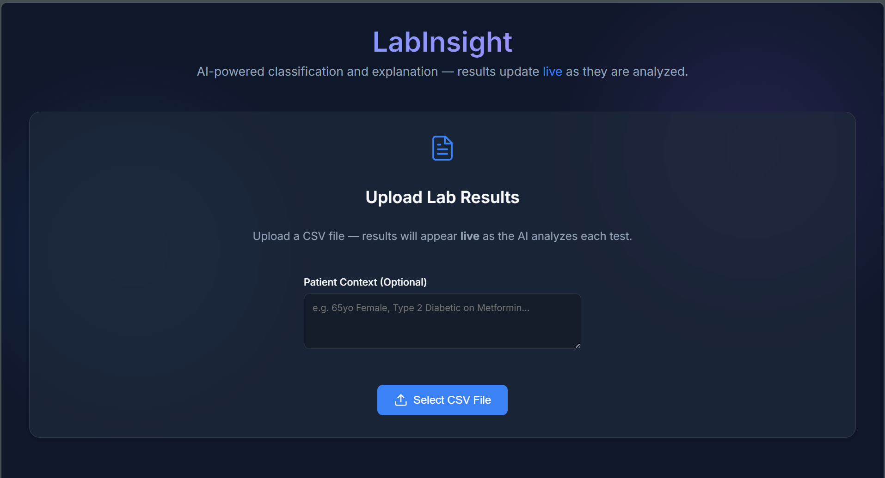
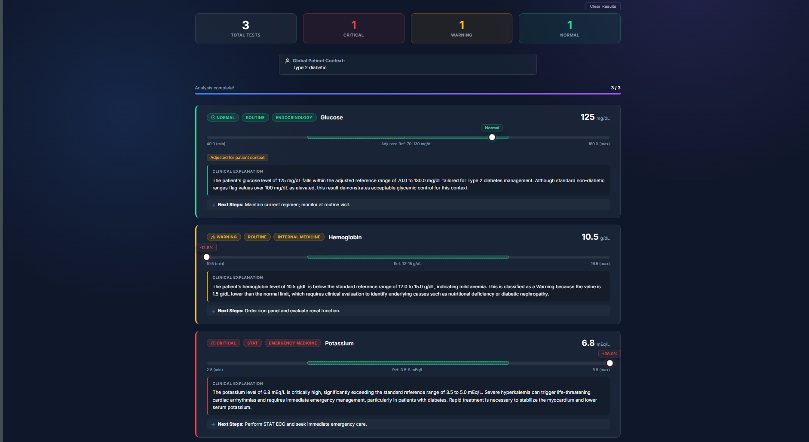
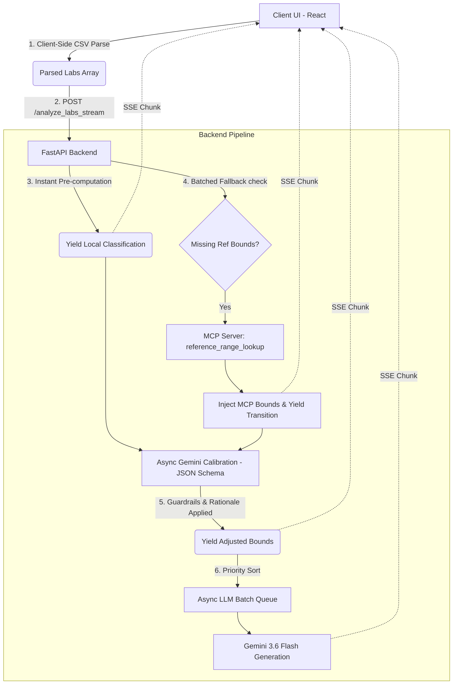

# LabInsight

<p align="center">
  
  
</p>

A full-stack, AI-powered Web Application designed to analyze clinical laboratory test results, classify their severity based on established reference ranges, route them by urgency and medical specialty, and generate AI-driven clinical explanations.

This project strictly adheres to **Explainable AI (XAI)** principles, ensuring that clinicians understand exactly *why* a result was flagged and how any AI-driven adjustments to reference bounds were made.

> 📖 **Full Technical Specs:** For a deep dive into the code flow, state management, API schemas, and component structure, please read the [Comprehensive Technical Documentation](DOCUMENTATION.md).

---

## Architecture



The application is built on a modern, decoupled architecture ensuring low latency, safety, and scalability.

- **Frontend (React 18 + Vite)**
  - Responsible for client-side CSV parsing using `PapaParse` to instantly render the skeleton UI.
  - Implements a stunning glassmorphism design system.
  - Renders a **Dual-Range Visual Gauge** that plots the test value against standard reference bounds and any AI-calibrated patient bounds.
  - Consumes Server-Sent Events (SSE) to update the dashboard live as AI explanations stream in.

- **Backend (Python FastAPI + Uvicorn)**
  - Exposes both streaming (`/analyze_labs_stream`) and bulk (`/analyze_labs`) endpoints.
  - Implements an **Async Batching Queue** using `asyncio.gather` and `asyncio.sleep` to respect external API rate limits (e.g., 5 requests per minute) while processing maximum concurrency.
  - **Priority Triage Routing**: Automatically sorts results so that `Critical` cases are processed and streamed to the UI before `Warning` and `Normal` cases.

- **Model Context Protocol (MCP)**
  - The architecture includes a localized `mcp_server.py` built on `FastMCP`.
  - The primary `Agent` uses the official `mcp.client.stdio` transport to dynamically spawn and communicate with the MCP server over JSON-RPC. 
  - **Batched Decoupling**: Rather than blocking the initial instant yield, the Agent instantly returns a skeleton state for all labs, then opens a single batched MCP session to resolve any missing bounds, streaming a transition event to the UI once they are found.

- **Context-Aware Dynamic Triage (Safety Guardrails)**
  - The AI dynamically calibrates numeric reference bounds based on the global **Patient Context** (e.g., "Type 2 Diabetic").
  - **Calibration Rationale (XAI)**: The LLM is forced by schema to provide a human-readable `rationale` whenever it adjusts a reference bound. This rationale is instantly streamed to the frontend before the deep clinical analysis even finishes.
  - **Guardrail 1 (Clamp Constraint)**: Adjustments are clamped to a maximum of ±40% of the standard clinical bound to prevent hallucination.
  - **Guardrail 2 (Fixed Criticals)**: The boundary between `Warning` and `Critical` is strictly mathematical and fixed. The AI cannot downgrade a true physiological emergency.
  - **Guardrail 3 (Fail-Closed)**: If the calibration API call fails, times out, or returns malformed JSON due to network hiccups, the system silently and safely falls back to standard bounds rather than crashing.
  - **Guardrail 4 (Schema Constraint)**: The system aggressively filters calibration responses, instantly rejecting any hallucinated test names that weren't in the uploaded batch.

---

## AI Provider Chosen: Google Gemini

This project utilizes **Google Gemini** (specifically the `gemini-3.6-flash` model via the `google-genai` SDK). Gemini was explicitly chosen for this clinical architecture due to:

1. **Strict JSON Schema Generation**: The `response_schema` configuration in Gemini perfectly forces the model to output strict Pydantic structures. This is critical for extracting the adjusted bounds (`CalibrationResponse`) and the final analysis (`AnalyzedResult`) without risking hallucinated keys or markdown formatting errors.
2. **Ultra-Low Latency**: The `flash` variant ensures that explanations are generated fast enough to provide a seamless UI streaming experience.
3. **Medical Reasoning Capability**: Gemini's expansive pre-training allows it to accurately connect clinical contexts (e.g., matching a Hemoglobin drop to Metformin use in Diabetics).

---

## Setup Instructions

### 1. Environment Setup
Create a `.env` file in the root of the project:
```env
GEMINI_API_KEY=your_gemini_api_key_here
```

### 2. Backend Setup
```bash
cd backend
python -m venv venv
.\venv\Scripts\activate
pip install -r requirements.txt

python main.py
```
*The backend runs on `http://localhost:8000`*

### 3. Frontend Setup
Open a new terminal window:
```bash
cd frontend
npm install
npm run dev
```
*The frontend runs on `http://localhost:5173`*

---

## How to Test

We have provided a comprehensive demo file to test all advanced layers of the architecture simultaneously.

1. Open the frontend at `http://localhost:5173`.
2. In the **Patient Context** box, type: `Type 2 Diabetic`
3. Click **Upload CSV** and select `test_data/test_demo_final.csv`.


**What you will observe during the test:**

- **Row 1 (Glucose = 125):** The result will instantly render as a yellow `Warning` (since 125 > 99). Two seconds later, Gemini completes the context calibration, and the UI visually transitions the gauge bounds. The card flips to a green `Normal` with an `Adjusted for patient context` badge!
- **Row 2 (Hemoglobin = 10.5):** This row in the CSV is intentionally missing its reference bounds. The backend Agent will successfully query the local **MCP Server** to fetch the bounds (`12.0 - 15.0`) and apply them to the visual gauge.
- **Row 3 (Potassium = 6.8):** This is a severe, life-threatening value. Even with the Patient Context active, the backend **Safety Guardrails** will block any LLM adjustment and lock the result as a red `Critical`. You will also see the `STAT` urgency and `Cardiology` routing badges correctly applied by the AI.

You can also test the system with any of the other provided CSVs in the `test_data` folder!
